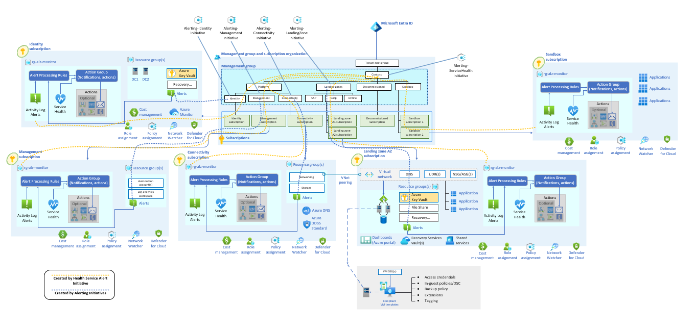

# Architecting for Success

---

## 107 - Azure Monitor Baseline Alerts
>

### Introduction

One of the most common questions faced when working with customers is, "What should we monitor in Azure?" and "What thresholds should we configure our alerts for?"

There isn't a definitive list of what you should monitor when you deploy something to Azure because "it depends", on what services you're using and how the services are used, which will in turn dictate what you should monitor and what thresholds the metrics you do decide to collect are and what errors you should alert on in logs.

Microsoft has tried to address this by providing a number of 'insights or solutions' for popular services which pull together all the things you should care about (Storage Insights, VM Insights, Container Insights); but what about everything else???

The purpose of Azure Monitor Baseline Alerts (AMBA) is to focus on monitoring for Azure Landing Zone as a common set of Azure resources/services that are configured in a similar way across organizations. We know that every organization is different, as such we also include guidance on how this can be used in custom brownfield scenarios that don´t align with ALZ. This provided us with a starting point on addressing "What should be monitored in Azure?" It also provides an example of how to monitor-at-scale while leveraging Infrastructure-as-code principles. This project is an opinionated view on what you should monitor for the key components of your Azure Landing Zone within the Platform and Landing Zone scope. i.e:

* Express Route Circuits
* Express Route Gateways
* Azure Firewalls
* Virtual Networks
* Virtual Network gateways
* Log Analytics workspaces
* Private DNS zones
* Azure Key Vaults

Monitoring baselines for the above components are proposed to be deployed leveraging Azure Policy and has been bundled into Azure Policy initiatives for ease of deployment and management. In addition to the components mentioned there are also a number of other component alerts included in the [repo](https://github.com/Azure/alz-monitor), but outside any initiatives, or disabled by default. These components are:

* Storage accounts
* Network security groups
* Azure route tables

In addition to the component specific alerts mentioned above the repo also contains policies for deploying service health alerts by subscription.

Alerts are based on Microsoft public guidance where available, and on practical application experience where public guidance is not available. For more details on which alerts are included please refer to Alert Details.

For details on how policies are grouped into initiatives please refer to [Azure Policy Initiatives](https://github.com/Azure/alz-monitor/wiki/AzurePolicyInitiatives).

In addition to the above of course the alerts need to go somewhere. To that end a generic action group and alert processing rule is deployed to every subscription in scope, also via policy. For more details around this, as well as the reasoning behind this approach please refer to [Monitoring and Alerting in ALZ](https://github.com/Azure/alz-monitor/wiki/Monitoring-and-Alerting-in-ALZ).
