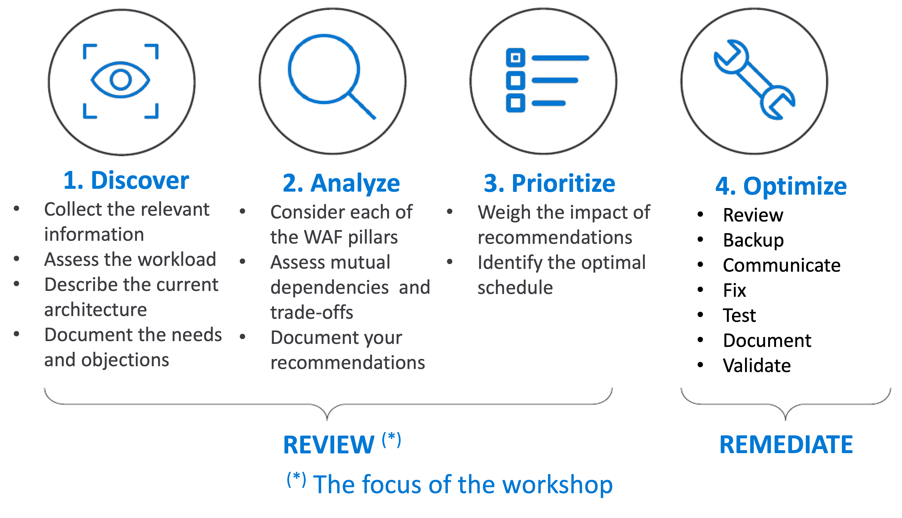

# Architecting for Success

---

## 105 - Azure Well Architected Workshop

### Workshop Introduction

The Well-Architected Framework (WAF) mindset focuses on overall workload health, highlighting the full picture of the customer's architecture, and the importance of an iterative, five-pillar approach.​ Working within a Well-Architected Framework requires a shift away from narrow, siloed solutions and toward holistic, integrative approaches to solving a customer's infrastructure as a service (IaaS) challenges. At the end of the workshop, participants will be able to:

* Outline customer needs, business priorities, and key architectural characteristics given a realistic customer workload.
* Conduct a cross-pillar analysis and determine key gaps in the workload's alignment with the Well-Architected Framework.
* Develop a prioritized list of recommendations and next steps.
* Practice proactive customer conversations around the Well-Architected Framework.

---

### Basics of the Well-Architected Framework

Employing a Well-Architected Framework begins with understanding the five-pillar approach, which acknowledges that any high-functioning framework addresses the following areas:

* Reliability - The ability of a system to recover from failures and continue to function.
* Security - Protecting applications and data from threats.
* Cost optimization - Managing costs to maximize the value delivered.
* Operational excellence - Operations processes that keep a system running in production.
* Performance efficiency - The ability of a system to adapt to changes in load.

The strategic and long-term viability of the workload requires an end-to-end, holistic review spanning all five pillars.

---

### Cross-functional areas

Our customers do not think of their needs and goals in terms of pillars. Rather, they seek to accomplish cross-functional goals to meet their business objectives. In this workshop, we'll review a customer scenario and identify solutions for five common cross-functional areas of focus:

* Resiliency - Analyze how business continuity and disaster recovery requirements are being addressed by the workload architecture and operational strategies.
* Performance and Scale - Analyze the performance and scalability requirements within the workload architecture; evaluate how they contribute to and/or are affected by the overall fault tolerance of the workload.
* Security, Governance & Identity - Analyze how security, governance, and identity requirements are being addressed by the workload architecture and operational strategies.
* DevOps - Analyze the automation and deployment strategies for the workload.
* Observability - Analyze how observability requirements are being addressed by the workload architecture and operational strategies.

---

### An iterative approach

It's also important to recognize that implementing a Well-Architected Framework requires an iterative approach, as described in the workflow diagram.

This workshop is primarily focused on phases one, two, and three, in which you:

* Discover the customer's needs
* Analyze to identify potential solutions
* Prioritize—or conduct triage to determine what needs to be implemented first

We will also discuss the optimization that occurs post-implementation to further enhance and refine the customer's architecture.
