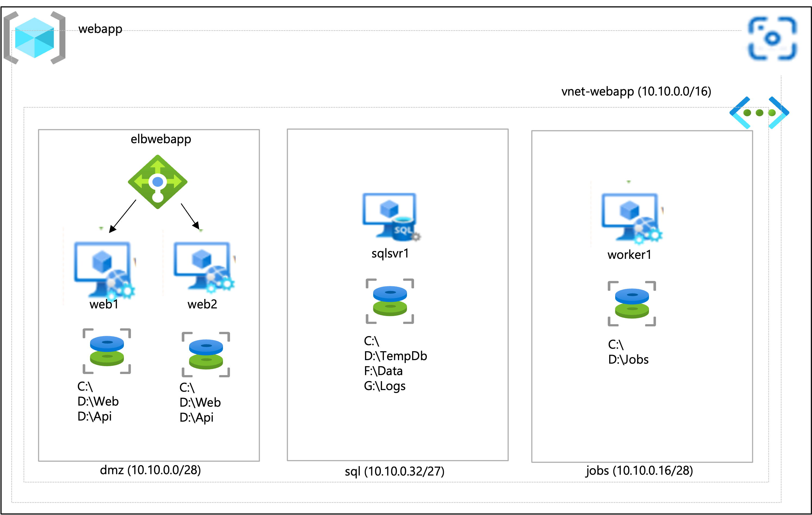

# Architecting for Success

---

## 106 - Microsoft Azure Well Architected Workshop

---

## Customer scenario: Costal Union Bank (IaaS)

### Part 1: Current state

Company profile
* Coastal Union Bank offers consumer banking services
* U.S.-based with market centers across multiple regions
* Central operations center in New York City

Technological landscape  
* Microsoft-centric IT environment
  * Virtualized workloads on the Hyper-V platform (single virtual machine [VM] image)
  * The VM image has all apps preinstalled and the OS-level firewall disabled
  * In-house-developed .NET core applications
  * Microsoft Enterprise Agreement (EA) with Software Assurance (SA)

Business continuity and disaster recovery (BCDR)
* Hot-cold distribution of services across two on-premises datacenters
* Requiring a manual failover to the standby DR site
* Relying on restores of production backup
* No existing disaster recovery plans

Operational model
* Ad-hoc, piecemeal application upgrades of in-house-developed apps resulting in:
  * Suboptimal performance
  * Increased vulnerabilities to cyber threats and exploits
    * Decreased reliability
* Increased maintenance/management overhead (as stated by the site reliability engineering team)

Security model
* A legacy approach based on per-user and per-resource level permissions
  * All customer experience team members have the contributor role
  * Azure Active Directory (Azure AD) Free edition

Internal IT knowledge / experience
* Expert knowledge of on-premises workloads but new to cloud
* Little experience with DevOps
  * All deployment and maintenance operations are performed manually

---

### Part 2: Customer needs

* Guidance in cloud-native approach to the design of the customer portal
* Help with adopting sound development practices
* Implementing workload-specific VM images
* Simplified security model
* Proactive security monitoring
* Security posture reporting
* Optimizing cloud spend
  * Assessing the current cloud workloads
  * Validating service of stock keeping units (SKUs)  
  * Recommending improvements without sacrificing reliability or performance
  * Reducing current operational costs
* Redesigning BCDR strategy to fully distributed, multi-region, hot-hot

---

### Part 3: Planned changes

* Transitioning on-premises workloads to Microsoft Azure
  * Applying native-cloud practices to in-house apps as part of the transition
  * Optimizing the operational model
  * Expanding to other countries

---

### Part 4: Current workload

* Primary customer portal
* Owned by the customer experience team
* An MVP version deployed to Azure
  * Balance and transaction history only (read-only access)
  * Live, so any unplanned downtime must be minimized
* Availability service-level agreements (SLAs) under normal operating conditions (currently not met)
  * Support for up to 10,000 concurrent users
  * Majority of page load times within the optimal limits
    * <1s- Excellent
    * 2-3s- Optimal
    * 3-5s- Minimum
    * > 5s- Unacceptable
* Uptime of 99.5% with a one-hour maintenance window per week
* Availability SLAs in BCDR scenarios (currently not met)
  * Recovery point objective of 30 minutes, recovery time objective of one hour

---

### Part 5: Current workload architecture

* Primary customer portal
  * Multitier architecture hosted on Azure VMs
    * Front end
    * IIS hosted using an independent application pool
    * Implements the form-based authentication
    * Backend application programming interfaces (APIs)
    * Internet Information Services (IIS) hosted using an independent application pool
* Background jobs running on schedule to process transactions in batches
* Shared database (SQL Server 2014 SP3) with mixed-mode authentication
  * Apps use locally stored secrets for their connection strings
* Accessible via a public Azure load balancer
  * Listening on Transmission-Control Protocol (TCP) ports 80 and 443
  * Configured with session affinity based on client IP and protocol
  * Using .NET Core 5.0 and hosted on the same Azure VM as separate applications

---

### Part 6: Current workload configuration

Server Name | OS | vCPUs | Memory (GiB) | Subnet | IP Address | Purpose
------------|----|-------|--------------|--------|------------|--------
web1 | Windows Server 2019 Datacenter | 8 | 16 | dmz | 10.10.0.4 | First load-balanced web server hosting front end and back end of the site
web2 | Windows Server 2019 Datacenter | 8 | 16 | dmz | 10.10.0.5 | Second load-balanced web server hosting front end and back end of the site
worker1 | Windows Server 2019 Datacenter | 8 | 16 | jobs | 10.10.0.20 | Server that hosts timer jobs
sqlsvr1 | Windows Server 2012 R2 Datacenter | 2 | 8 | sql | 10.10.0.36 | SQL Server 2014 SP3 for the website
