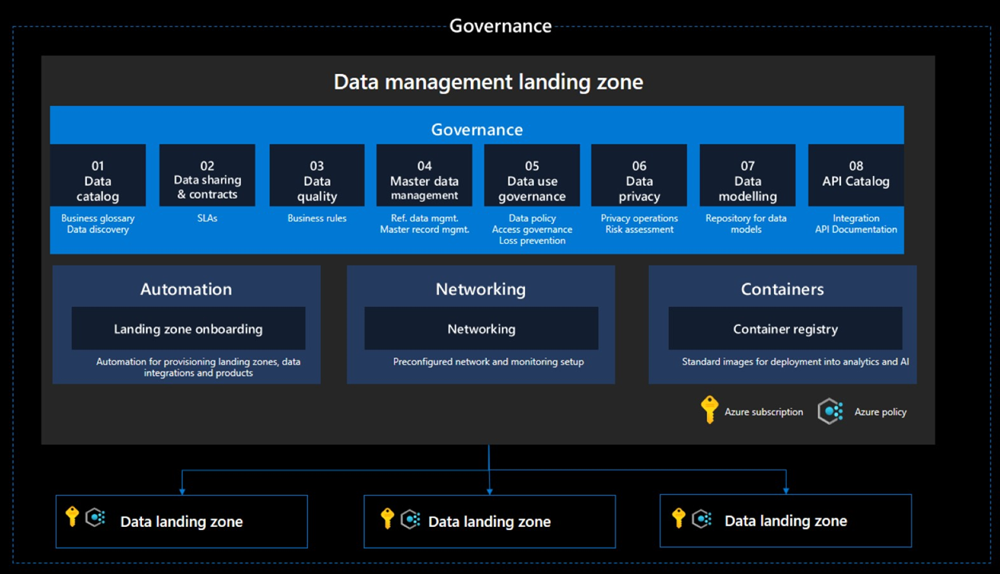

# Architecting for Success

## 105 - Cloud Scale Analytics

---

## Overview

With larger, more sophisticated forms of cloud adoption, your journey to the cloud becomes more complex. Azure cloud-scale analytics is a scalable, repeatable framework that meets your organization's unique needs for building modern data platforms.

Cloud-scale analytics covers both technical and non-technical considerations for analytics and governance in the cloud. This guidance strives to support hybrid and multicloud adoption by being cloud agnostic, but the included technical implementation examples focus on Azure products.

Cloud-scale analytics has the following goals:

* Serve data as a product, rather than a byproduct
* Provide an ecosystem of data products, rather than a singular data warehouse that might not best fit your data scenario
* Drive a default approach to enforce data governance and security
* Drive teams to consistently prioritize business outcomes instead of focusing just on the underlying technology.

Cloud-scale analytics builds upon Microsoft's cloud adoption framework and requires understanding of landing zones. If you don't already have an implementation of Azure landing zones, consult your cloud teams about how to meet prerequisites.

Reference architectures allow you to begin with a small footprint and grow over time, adapting the scenario to your use cases.

Cloud-scale analytics includes repeatable templates that accelerate five core infrastructure and resource deployments. It's also adaptable for different organization sizes. If you're a small enterprise with limited resources, a centralized operations model mixed with some business subject matter experts might fit your situation. If you're a larger enterprise with autonomous business units (each with their own data engineers and analysts) as your goal, then a distributed operating model such as data mesh or data fabric might better address your needs.
